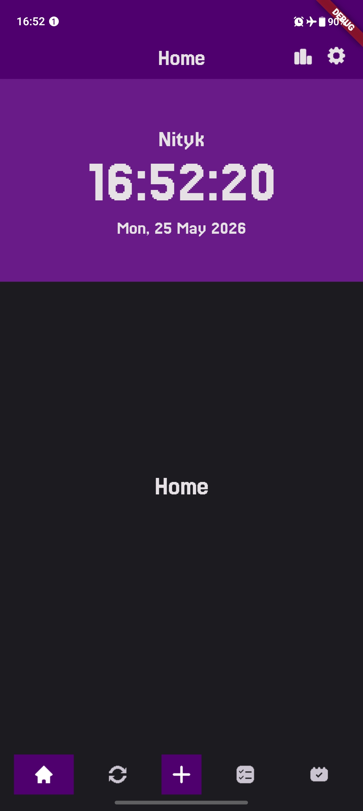
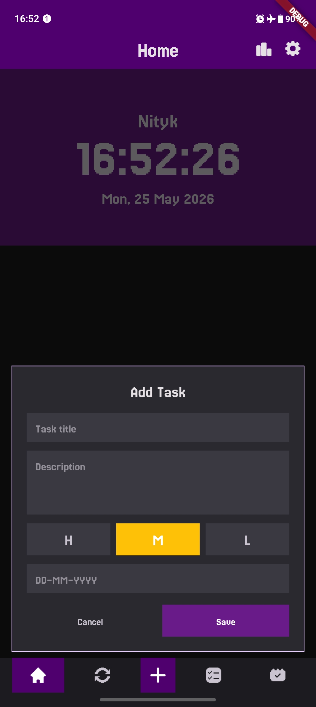
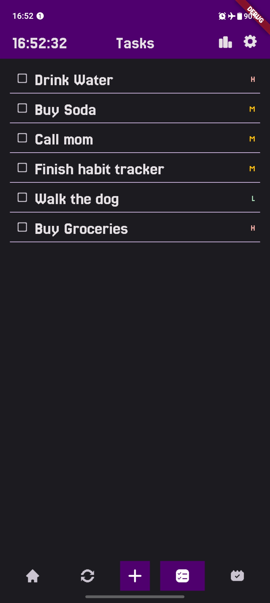

# Nityk

Fully custom UI Task Management Android app built with Flutter.

## UI

## Features

- Task Management

## Tech

- Flutter 3.41.2, Dart 3.11, Android min API 29
- `sqflite` for local persistence
- No Material, no Navigator — custom widgets and screen stack
